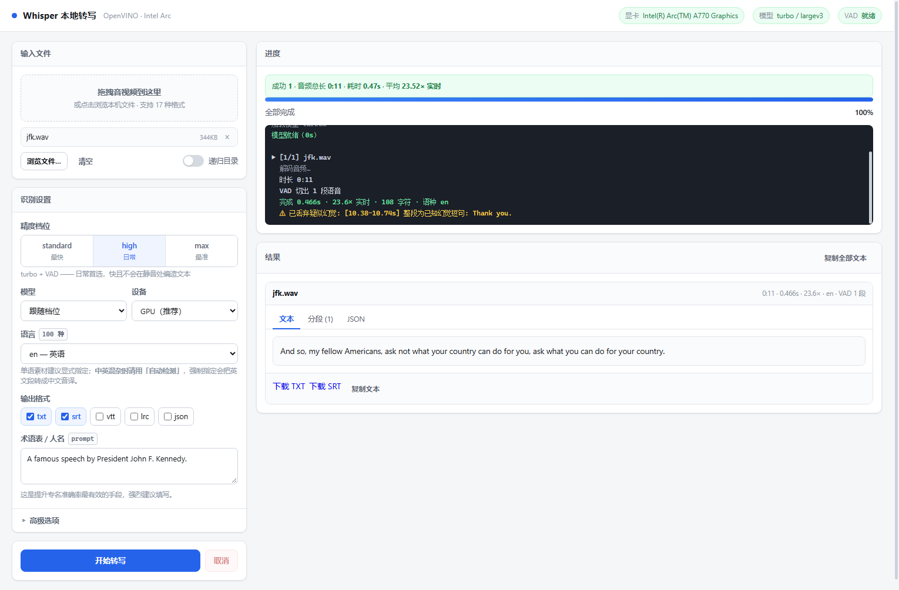
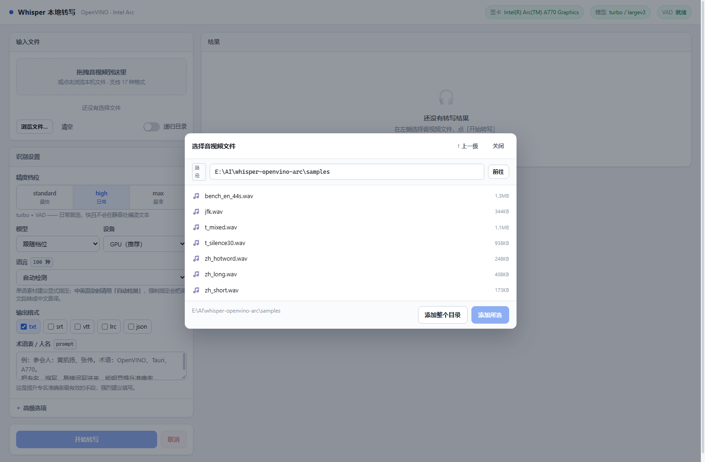

<div align="center">

# 🎙 Whisper · Intel Arc · OpenVINO

**在你的 Intel 独显上跑 Whisper，纯本地、不联网、不上传音频**

[](https://www.microsoft.com/windows)
[](https://www.python.org/)
[](https://github.com/openvinotoolkit/openvino)
[](LICENSE)
[](#开发与测试)

<br>



*内置 Web 界面：拖拽选文件、实时进度、结果三视图、一键下载*

</div>

---

## 这是什么

一个把 **OpenAI Whisper** 部署到 **Intel Arc 独显**上的完整方案。基于 OpenVINO GenAI，
pip 装完就能用，不需要编译任何东西。

- **快** — Arc A770 上 **55× 实时**，10 分钟录音约 13 秒出稿
- **准** — 内置 Silero VAD 静音门控，干掉 Whisper 最出名的「静音幻觉」问题
- **好用** — Web 界面点选 / 命令行批量 / 拖拽文件，三种用法

> **English**：A Windows-focused toolkit that runs Whisper on Intel Arc GPUs via OpenVINO GenAI.
> Highlights: Silero VAD gating to suppress Whisper's silence hallucination, standards-compliant
> SRT/VTT/LRC output cross-validated against ffmpeg, and a zero-dependency local web UI.
> The Python core is cross-platform; only the `.bat` launchers are Windows-specific.

---

## 目录

- [特性](#特性)
- [性能实测](#性能实测)
- [快速开始](#快速开始)
- [三种用法](#三种用法)
- [参数说明](#参数说明)
- [输出格式](#输出格式)
- [工作原理](#工作原理)
- [项目结构](#项目结构)
- [常见问题](#常见问题)
- [已知限制](#已知限制)
- [开发与测试](#开发与测试)
- [致谢](#致谢)
- [许可](#许可)

---

## 特性

### 🚀 性能

- **OpenVINO GenAI 推理**，FP16 精度，充分利用 Arc 的 XMX 矩阵单元
- GPU 相对 CPU 提速 **约 13.6 倍**
- 44 秒音频 **0.79 秒**跑完（约 55× 实时）
- 批量模式只加载一次模型，文件越多平均越快

### 🎯 准确性

- **Silero VAD 静音门控** — 本项目最重要的一个设计，见下方说明
- **large-v3 / large-v3-turbo** 双模型可选，极端噪声下 large-v3 明显更稳
- 支持 `initial_prompt` 喂术语表，显著提升人名、专有名词准确率
- 100 种语言，中文输出默认简体

### 🛡 静音幻觉治理

Whisper 在**非语音段**会凭空编造文本。实测：

| 输入 | 不开 VAD | 开 VAD |
|---|---|---|
| 30 秒纯静音（中文） | `请不吝点赞 订阅 转发 打赏支持明镜与点点栏目` | **（空）** |
| 30 秒纯静音（英文） | `Thank you.` | **（空）** |
| 50Hz 工频干扰 | `Thank you.` | **（空）** |

任何有停顿的录音（会议、讲座、访谈、Vlog）都会中招，而且输出**看起来很正常**，
不逐句核对根本发现不了。实测 `initial_prompt` 和 `temperature=0` 都压不住它。

本项目用**两道防线**解决：

1. **切片门控** — 只把语音段送进模型，长静音根本不进 Whisper
2. **时间轴门控** — 识别结果里落在非语音区的片段一律丢弃

并且会明确告警，不静默处理：

```
⚠ 已丢弃疑似幻觉: [10.38-10.74s] 整段为已知幻觉短句: Thank you.
```

### 📄 合规的字幕输出

SRT / VTT / LRC 全部经过**格式规范校验 + ffmpeg 实际解析双重验证**：

- 时间戳正确进位（不会出现非法的 `00:00:60,000`）
- 零时长字幕补齐、消除时间重叠
- WebVTT 正确转义 `& < >`，处理规范禁止的字面量 `-->`
- LRC 带标准元数据标签，时间戳用规范要求的**厘秒两位**

### 🖥 友好的使用方式

- **Web 界面** — 内置目录浏览器、拖拽上传、SSE 实时进度、可取消
- **命令行** — 支持目录递归、批量、脚本化
- **拖拽** — 把文件拖到 `.bat` 上就行
- 支持 17 种音视频格式，**视频自动抽音轨，不需要另装 ffmpeg**

### 🔧 工程化

- 参数写错会在**加载模型之前**拦住，给出可读提示（不会白等十几秒才报错）
- 55 项命令行回归自检 + 39 项浏览器端到端测试
- 精度评测工具：用劣化样本算 WER，调参不靠感觉

---

## 性能实测

测试机：**Intel Arc A770 16GB + AMD Ryzen 5 5600 + Windows 11**
音频：44 秒英文语音，预热后取两次最快值。

| 模型 | 设备 | 耗时 | 实时倍速 |
|---|---|---|---|
| **large-v3-turbo FP16** | **Arc A770 GPU** | **0.79 s** | **55.5×** |
| large-v3-turbo FP16（含 VAD） | Arc A770 GPU | 1.06 s | 41.6× |
| large-v3 FP16 | Arc A770 GPU | 2.71 s | 16.3× |
| large-v3-turbo FP16 | Ryzen 5 5600 CPU | 11.44 s | 3.8× |
| large-v3 FP16 | Ryzen 5 5600 CPU | 19.36 s | 2.3× |

换算成直观感觉（turbo + GPU）：

| 音频时长 | 预计耗时 |
|---|---|
| 10 分钟 | 约 13 秒 |
| 1 小时 | 约 75 秒 |
| 2 小时 | 约 2.5 分钟 |

> 模型加载另需 5~11 秒，一个进程只加载一次，批量转写时会被摊薄。
> VAD 额外开销约 27%（11 秒音频的 VAD 只需 50~150ms）。

自己复测：

```bat
whisper.bat samples\bench_en_44s.wav --bench -l en
```

---

## 快速开始

### 环境要求

| | |
|---|---|
| 系统 | Windows 10 / 11 |
| 显卡 | Intel Arc 独显（A 系列 / B 系列）；核显也可但较慢 |
| 驱动 | Intel 显卡驱动 **31.0.101.4xxx 以上** |
| Python | **3.10 或更高**（3.13 有官方 wheel） |
| 磁盘 | 约 5 GB（虚拟环境 400MB + 模型 4.5GB） |
| 网络 | 首次安装需要（下载依赖和模型，之后完全离线） |

> 没装 Python？去 [python.org](https://www.python.org/downloads/) 下载，
> 安装时**务必勾选 "Add python.exe to PATH"**。

### 安装

```bat
:: 1. clone 或下载解压到任意目录
git clone <this-repo> whisper-openvino-arc

:: 2. 右键 setup.bat -> 以管理员身份运行
::    会自动：建虚拟环境 -> 装依赖 -> 下模型 -> 环境自检
```

装完看到这个就可以用了：

```
  结论: 环境正常，可以直接用 whisper.bat 转写。
```

> **国内网络提示**：项目默认从**魔搭 ModelScope** 下载模型（HuggingFace 在国内常不可达），
> 不需要额外配置。
>
> **手动安装**（不想用 `setup.bat`）：
> ```bat
> python -m venv venv
> venv\Scripts\python.exe -m pip install -r requirements.txt
> venv\Scripts\python.exe tools\download_models.py
> venv\Scripts\python.exe tools\check_env.py
> ```

---

## 三种用法

### 用法一：Web 界面

```bat
webui.bat
```

会自动打开浏览器（默认 `http://127.0.0.1:8765/`）。关掉命令行窗口即停止。



**能做的事**：内置目录浏览器逐级点选文件、拖拽上传、精度档位/模型/设备/语言/格式全可视化配置、
实时进度日志、结果三视图（文本 / 分段表 / JSON）、一键复制、直接下载各种格式、长任务可取消。

> 服务**只监听 127.0.0.1**，不对外网开放。

### 用法二：拖拽

把音频/视频文件直接拖到 **`whisper.bat`** 上，松手即可。默认 `high` 档，输出同名 `.txt`。

### 用法三：命令行

```bat
:: 基本用法
whisper.bat "D:\media\会议录音.mp3"

:: 要中文字幕
whisper.bat "D:\media\讲座.mp4" -a max -l zh -f srt

:: 整个目录批量（递归），多格式输出
whisper.bat "D:\media" -r -a max -l zh -f srt txt json

:: 喂术语表提升专名准确率
whisper.bat "D:\media\访谈.wav" --prompt "参会人：张三、李四。术语：OpenVINO、Tauri"

:: 性能基准
whisper.bat "D:\media\a.wav" --bench
```

**支持的输入格式**（17 种）：
`wav` `mp3` `flac` `m4a` `aac` `ogg` `opus` `wma`
`mp4` `mkv` `mov` `avi` `webm` `ts` `flv` `wmv` `m4v`

---

## 参数说明

### 要最精确，就三件事

```bat
whisper.bat "D:\media\会议录音.mp3" -a max -l zh --prompt "参会人：张三。术语：OpenVINO"
```

| | 做什么 | 为什么 |
|---|---|---|
| 1 | `-a max` | 用 **large-v3** 大模型，不用 turbo 蒸馏版 |
| 2 | `-l zh` | **显式指定语言**。auto 检测在短音频、嘈杂环境下会误判 |
| 3 | `--prompt "..."` | 把**人名、术语、专名**喂进去，提升专名准确率最有效的手段 |

> ⚠️ **第 2 条有个例外**：素材里**混着多种语言**时**不要**指定语言，用默认 `auto`。
> 实测强制 `-l zh` 会把中间的英文段落转成中文音译，直接毁掉那段内容。

### 三条「不要做」

| ❌ | 原因 |
|---|---|
| 不要用 `--beams` | **该后端不支持 beam search，会直接崩溃**，还会污染 pipeline 状态 |
| 不要用 `repetition_penalty` | 实测让 WER 从 0% 升到 4.5% |
| 不要关掉 VAD | 静音段会凭空产生幻觉文本（见上文） |

### 完整参数表

| 参数 | 说明 | 默认 |
|---|---|---|
| `-a, --accuracy` | 精度档位 `standard` / `high` / `max` | `high` |
| `-m, --model` | `turbo` / `largev3` / `turbo-int8` / `largev3-int8` | 由档位决定 |
| `-d, --device` | `GPU` / `CPU` / `AUTO` / `GPU.0` | `GPU` |
| `-l, --language` | `auto` / `zh` / `en` / `ja`… 共 100 种，支持「中文」「粤语」等别名 | `auto` |
| `--prompt` | initial_prompt：术语、人名、专名 | — |
| `--hotwords` | 热词表（逗号分隔） | — |
| `-f, --format` | `txt` `srt` `vtt` `lrc` `json` `all`，可多选 | `txt` |
| `-o, --output-dir` | 输出目录 | 源文件同目录 |
| `-r, --recursive` | 目录递归 | 关 |
| `--show-text` | 终端打印识别结果 | 关 |
| `--vad` / `--no-vad` | 静音门控开关 | 开 |
| `--vad-merge-gap` | 语音间隔小于此毫秒数就并成一块（保上下文） | `2500` |
| `--vad-min-silence` | 静音超过此毫秒数才算一段结束 | `300` |
| `--vad-max-block` | 单个识别块最长秒数 | `28` |
| `--keep-hallucination` | 保留疑似幻觉片段 | 关 |
| `--timestamp-names` | 输出文件名加时间戳，避免覆盖 | 关 |
| `--bench` | 性能基准模式 | — |
| `--list-models` | 列出模型及下载状态 | — |
| `--list-languages` | 列出全部 100 个语言码 | — |

### 精度档位

| 档位 | 模型 | VAD | 适用场景 |
|---|---|---|---|
| `standard` | turbo | 关 | 干净单人录音，追求最快 |
| `high` | turbo | **开** | **默认**，日常首选 |
| `max` | large-v3 | **开** | 重要素材、噪声环境、需要最高准确率 |

`-m` 可单独覆盖档位的模型：`whisper.bat a.mp3 -a max -m turbo`（保留 max 的 VAD 配置但换 turbo 提速）。

### 参数写错会立刻提示

`-l` 是**语言**，`-f` 才是**输出格式**，很容易写反。程序会在**加载模型之前**校验：

```
$ whisper.bat "会议录音.mp4" -a max -l txt

✗ 语言码 'txt' 不是 Whisper 支持的语言（模型 'largev3' 共支持 100 个）。

  你是不是想指定**输出格式**？那要用 -f 而不是 -l：
      whisper.bat "你的文件.mp4" -f txt

  常用：zh 中文普通话  yue 粤语  en 英语  ja 日语  ko 韩语 …
  全部列表：--list-languages
  不想指定就让程序自动检测：去掉 -l 参数（默认 auto）
```

拼错了会给出近似建议（`-l zhh` → `最接近的可用语言码：zh`），设备写错同理。

---

## 输出格式

五种格式，全部为 **UTF-8 无 BOM、LF 换行**（固定不变，不随操作系统变化）。

| 格式 | 说明 | 时间戳写法 |
|---|---|---|
| `txt` | 纯文本全文 | 无 |
| `srt` | SubRip 字幕，VLC / PotPlayer / MPC-HC / PR / 剪映 通用 | `HH:MM:SS,mmm` |
| `vtt` | WebVTT，网页 `<track>` / YouTube / B站 通用 | `HH:MM:SS.mmm` |
| `lrc` | 歌词，音乐播放器用 | `[MM:SS.cc]`（厘秒两位） |
| `json` | 结构化数据，含分段、词级、性能指标 | 秒（浮点） |

### 生成前会自动做的整理

- **时间戳永不出 `:60`** — 先取整到毫秒再分解时分秒，数学上不可能越界
- **零时长字幕补齐到最短 0.5 秒** — `start == end` 的字幕很多播放器直接丢弃
- **消除时间重叠** — 重叠会让播放器显示错乱，同时按开始时间重新排序
- **丢掉空文本字幕**
- **WebVTT 转义** `&` `<` `>` 为 `&amp;` `&lt;` `&gt;`（顺带处理规范禁止的 `-->`）
- **LRC 补元数据标签** — `[ti:文件名]` `[by:Whisper / OpenVINO]` `[offset:0]`
- **没有分段时不写 srt/vtt/lrc** — 避免生成空白的非法文件

### 体检自己的产物

```bat
venv\Scripts\python.exe tools\subtitle_check.py 输出目录
```

逐条列出违规（序号不连续、时间戳越界、重叠、未转义等），并用 **ffmpeg 真实解析**做交叉验证。

> **关于字幕折行**：SRT 格式本身不规定行长，所以这里保持原文不折行。
> 需要按广播惯例（英文 42 字符 / 中文约 20 字）自动折行的话，欢迎提 issue。

---

## 工作原理

```
音频 / 视频
   │  PyAV 解码 → 16kHz 单声道 float32
   ▼
Silero VAD（OpenVINO，跑在 CPU）
   │  512 点/窗推理语音概率 → 迟滞判定 → 语音段
   │  合并 <2.5s 间隔 → 切成 ≤28s 的块 → 两侧补 150ms 留白（夹中点，绝不重叠）
   ▼
逐块送 Whisper large-v3 / turbo（OpenVINO GPU，FP16）
   │  每块拿到分段时间戳
   ▼
两重过滤
   │  ① 时间轴门控：与语音区间重叠 <30% 的段 → 丢弃
   │  ② 文本过滤：已知幻觉短语 / 重复循环 → 丢弃
   ▼
合并 → txt / srt / vtt / lrc / json
```

### 几个设计取舍

**VAD 放 CPU 而不是 GPU。** 实测 11 秒音频 VAD 在 CPU 上 60ms、GPU 上 448ms ——
小模型在 GPU 上被逐次调用开销拖垮。CPU 反而快 7 倍，还省下显存给 Whisper。

**切块要「合并」而不是「切碎」。** 单纯按语音段切会切太碎丢上下文。
默认把 2.5 秒以内的停顿合并成一块，既保留句子上下文，又不会把长静音并进来。
（这个默认值是踩坑调出来的：设 1.5 秒时，句中停顿会被切开，边界处的字词会丢，
WER 从 0% 涨到 4.5%。）

**Web 服务只用 Python 标准库。** 不引 Flask/FastAPI，避免给离线环境加依赖。
任务串行（pipeline 单例占显存）、进度走 SSE、取消是协作式的（不硬杀线程，
所以已识别的部分结果能保留）。

**CLI 与 Web 共用同一套核心。** 不是两套逻辑，通过回调注入进度。

---

## 项目结构

```
whisper-openvino-arc/
├── webui.bat              Web 界面启动器
├── whisper.bat            命令行 / 拖拽启动器
├── setup.bat              一键安装（建环境 + 装依赖 + 下模型 + 自检）
├── transcribe.py          转写核心（CLI + 供 Web 复用的 API）
├── requirements.txt       依赖清单
│
├── webui/                 本地 Web 服务
│   ├── server.py          服务端（标准库 http.server，零额外依赖）
│   ├── static/            前端（原生 HTML/CSS/JS）
│   │   ├── index.html
│   │   ├── style.css
│   │   └── app.js
│   └── e2e-test.mjs       浏览器端到端测试（39 项断言）
│
├── tools/                 工具集
│   ├── vad.py             Silero VAD 封装
│   ├── subtitle_check.py  字幕/歌词格式合规校验器
│   ├── selftest.py        回归自检（55 项）
│   ├── eval_accuracy.py   精度横向评测（WER / 幻觉）
│   ├── check_env.py       环境自检
│   ├── download_models.py 模型下载器（魔搭）
│   └── get_samples.py     测试音频下载器
│
├── docs/screenshots/      界面截图
├── models/                模型（自动下载，不进版本库）
└── uploads/               拖拽上传的临时文件
```

---

## 常见问题

<details>
<summary><b>没检测到 GPU / 速度很慢</b></summary>

1. 先跑自检看设备列表：
   ```bat
   venv\Scripts\python.exe tools\check_env.py
   ```
2. `available_devices` 里应该有 `GPU`。没有的话装/更新 Intel 显卡驱动
   （Arc 需要 **31.0.101.4xxx 以上**）。
3. 速度慢通常是有别的程序在抢显卡（模拟器、远程桌面软件等）。
4. 确认参数是 `-d GPU`（默认就是）。

</details>

<details>
<summary><b>输出里出现了「请不吝点赞…」这类莫名其妙的文本</b></summary>

这是 Whisper 的静音幻觉。检查：

1. VAD 模型是否存在（`tools\download_models.py vad`）
2. 有没有误加 `--no-vad`

程序默认开启 VAD，正常情况下不会出现这个问题。

</details>

<details>
<summary><b>转写结果是繁体字</b></summary>

Whisper 中文输出偶尔会偏繁体。加个 prompt 引导即可：

```bat
whisper.bat a.mp3 -l zh --prompt "以下是普通话的句子。"
```

</details>

<details>
<summary><b>中英混杂的素材，英文段落被转成了奇怪的中文</b></summary>

去掉 `-l` 参数，用默认的 `auto` 让模型自己判断。
强制指定单一语言会让模型把其它语言「音译」成目标语言。

</details>

<details>
<summary><b>下载模型失败 / 卡住</b></summary>

模型从**魔搭 ModelScope** 下载（HuggingFace 在国内不可达）。单独重试：

```bat
venv\Scripts\python.exe tools\download_models.py
venv\Scripts\python.exe tools\download_models.py vad
```

</details>

<details>
<summary><b>Web 界面打不开</b></summary>

1. 确认那个黑色命令行窗口还开着
2. 端口被占会自动顺延，看窗口里实际打印的地址
3. 浏览器手动访问 `http://127.0.0.1:8765/`

</details>

<details>
<summary><b>想换到另一台电脑</b></summary>

整个目录拷过去，在目标机器上跑一次 `setup.bat` 即可（会复用已有环境，只补装缺的）。
从零重建就删掉 `venv` 和 `models` 再运行 `setup.bat`。

</details>

---

## 已知限制

本项目的不足，如实列出。

### 1. 不支持 `--task translate`（翻成英文）

Whisper 原生的「翻译成英文」任务在这个后端上**完全不工作**。已排除是配置问题：

- 模型 `generation_config.json` 里有 `"forced_decoder_ids": [[1,null],[2,50360]]`
  把词元钉死为 `<|transcribe|>`
- kwargs 传 `task="translate"`、config 对象设 `cfg.task`、语言写成 `<|zh|>` —— 三种都无效
- 直接改配置**硬钉** `<|translate|>` (50359) —— 输出仍是原语言

结论：OpenVINO GenAI `WhisperPipeline` 的实现限制。需要翻译请另配翻译模型。

### 2. 不支持 beam search

`num_beams > 1` 会抛 `RuntimeError`，且**崩溃后会污染 pipeline 内部状态**，
导致后续调用返回陈旧缓存结果。所以经典的高精度手段 beam search 在这套后端上拿不到。

### 3. 不支持词级时间戳

FP16-OV 模型的编码器未做 cross-attention 分解，`word_timestamps=True` 会抛
`Encoder attention heads are not decomposed`。程序自动降级到句级。
需要词级时间戳请改用 `whisper.cpp` + ggml 模型。

### 4. 面向 Windows

启动脚本是 `.bat`。Python 核心代码是跨平台的，Linux/macOS 上可以直接调：

```bash
python transcribe.py audio.mp3 -l zh -f srt      # CLI
python webui/server.py                            # Web 界面
```

但本项目**没有在 Linux 上实测过**，Intel 独显在 Linux 上的驱动与 OpenVINO 配置差异较大。

### 5. 长音频建议先分段

超过 1 小时的文件建议自行切分，便于增量处理和中断续跑。

### 6. 批量转写输出会压平到同一目录

不同子目录下的同名文件已自动加 `__1`/`__2` 后缀防覆盖，但目录层级不会保留。

---

## 开发与测试

### 跑测试

```bat
:: 核心逻辑 + 格式合规（55 项）
venv\Scripts\python.exe tools\selftest.py

:: 只体检字幕/歌词格式
venv\Scripts\python.exe tools\subtitle_check.py 目录

:: 精度横向评测（WER / 幻觉）
venv\Scripts\python.exe tools\eval_accuracy.py

:: Web 界面（39 项，需先启动 webui.bat）
node webui\e2e-test.mjs
```

### 测试覆盖了什么

| 套件 | 项数 | 覆盖内容 |
|---|---|---|
| `tools/selftest.py` | **55** | 环境与设备、VAD 行为、切片完整性、转写正确性（已知原文逐字比对）、静音幻觉抑制、参数校验、字幕格式合规、速度 |
| `webui/e2e-test.mjs` | **39** | 页面初始化、顶栏状态、控件选项、目录浏览、选文件、跑转写、结果正确性、标签页、下载、控制台零报错、错误路径 |
| `tools/subtitle_check.py` | — | SRT/VTT/LRC 逐条规范校验 + **ffmpeg 交叉验证** |
| `tools/eval_accuracy.py` | — | 合成噪声/混响/窄带劣化，客观算 WER |

浏览器测试用的是**系统自带的 Edge + CDP 协议**，通过 Node 内置的 `WebSocket` 直连，
**零 npm 依赖**，不需要下载 Playwright/Chromium。

### 改代码时注意

- 动 `transcribe.py` 的转写流程后，跑一遍 `tools/selftest.py` 确认没退化
- 动 `webui/static/` 后，跑一遍 `node webui/e2e-test.mjs`
- 输出格式相关改动，`subtitle_check.py` 会自动用 ffmpeg 交叉验证

---

## 致谢

本项目站在这些优秀的开源工作之上：

| 项目 | 用途 | 许可 |
|---|---|---|
| [OpenAI Whisper](https://github.com/openai/whisper) | 语音识别模型 | MIT |
| [OpenVINO™ Toolkit](https://github.com/openvinotoolkit/openvino) | Intel 硬件推理加速 | Apache-2.0 |
| [OpenVINO™ GenAI](https://github.com/openvinotoolkit/openvino.genai) | WhisperPipeline 高层 API | Apache-2.0 |
| [Silero VAD](https://github.com/snakers4/silero-vad) | 语音活动检测 | MIT |
| [PyAV](https://github.com/PyAV-Org/PyAV) | 音频解码（自带 ffmpeg） | BSD-3-Clause |
| [ModelScope 魔搭](https://www.modelscope.cn/) | 提供 OpenVINO IR 模型下载 | — |

模型权重为 **OpenVINO 官方转换版**，托管在魔搭 ModelScope。

---

## 许可

[MIT License](LICENSE)

---

<div align="center">

**如果这个项目帮到了你，给个 ⭐ 是最大的鼓励**

</div>
